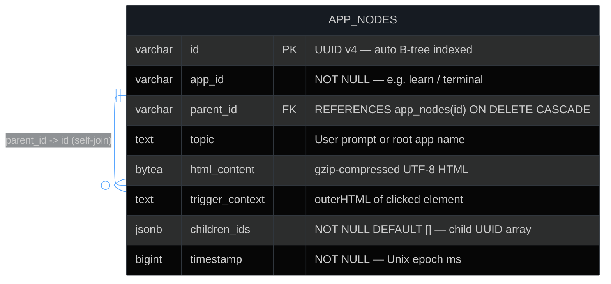
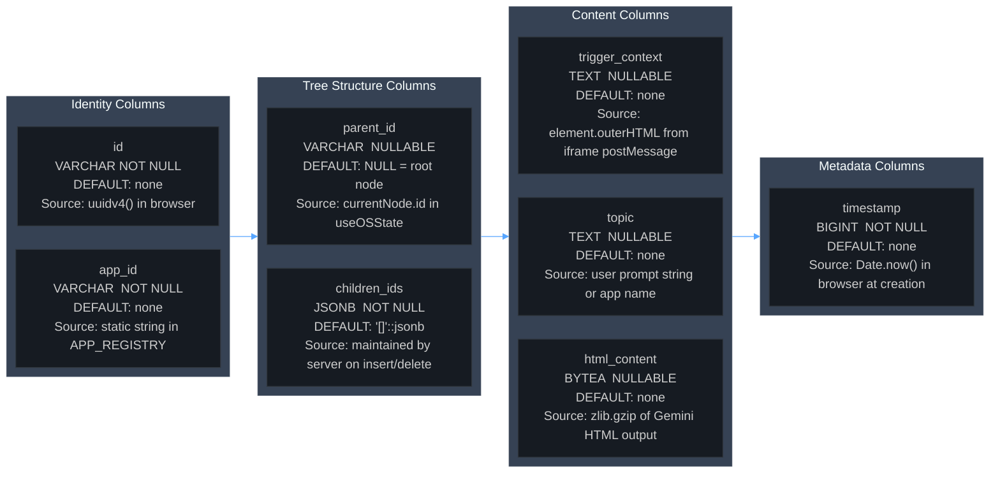
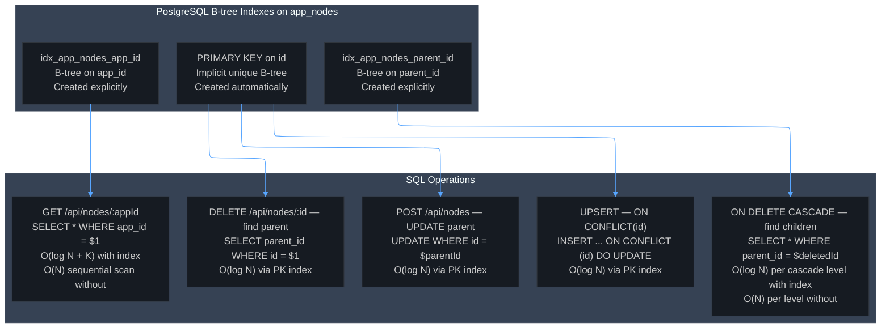
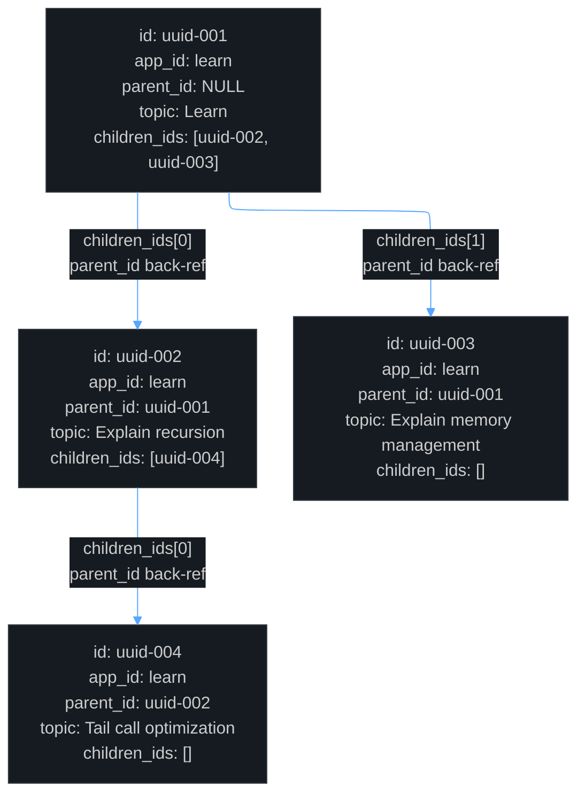

The entire system begins with the concept of what a "running program" actually is from first principles. Every process executing on a computer has three things: the code instructions that tell it what to do, a heap region where dynamically allocated objects live during execution, and a stack that tracks which function is currently running and where to return when it finishes. When you close a program, the operating system's memory manager marks every single byte of that heap and stack region as free. The data is not "deleted" in the sense of being physically erased, but the OS will hand those pages to the next process that requests them, overwriting whatever was there. This is volatile storage. The foundational design decision of this project is a total rejection of volatile storage as the primary medium for application state. Instead of holding the current state of each application in JavaScript heap objects that the garbage collector can reclaim, every distinct configuration of every application is immediately written to a relational database on disk, which is managed by PostgreSQL. This means the application's ground truth is not in RAM at all. RAM is just a mirror, a cache of what PostgreSQL already holds permanently. This is not a minor implementation detail. It is an architectural inversion of the normal relationship between memory and storage.

Let us now trace exactly what happens the moment a user opens an application for the first time, because this is where the DBMS integration becomes a concrete, traceable sequence of operations. The user clicks an application icon. The DesktopShell component, which is a React component tree managing a list of WindowState objects and a keyed record of AppSession objects, receives this event and calls the openApp function exported from the useOSState hook. The openApp function is defined with useCallback and has a dependency list that is intentionally left empty, which means it is created exactly once on the component's initial mount and holds a stable reference for the entire lifetime of the application process. This stability is critical because async callbacks that are recreated on every render would cause stale closure issues where the callback captures old values of state variables. Inside openApp, the system immediately creates a new windowId using the uuid v4 algorithm, which generates a 128-bit random number formatted as a string in the standard 8-4-4-4-12 hexadecimal pattern. This ID is statistically guaranteed to be unique across any two invocations anywhere in the world. The system then dispatches a state update to the React windows array adding a new WindowState entry with isLoading set to true, and immediately after that, it fires an HTTP GET request to its own local Express backend server which is running on port 3001, specifically to the route GET /api/nodes/:appId, passing the application's static string ID like "learn" or "terminal" as the URL parameter. This GET request crosses the loopback network interface, which means it goes through the OS's network stack even though the client and server are on the same machine. The Express server receives this request, pulls a client connection from its PostgreSQL connection pool, and executes the SQL query SELECT star FROM app_nodes WHERE app_id equals dollar-one, where the dollar-one is a parameterized placeholder that gets bound to the appId string. PostgreSQL's query executor walks the B-tree index called idx_app_nodes_app_id, which was created specifically on the app_id column to avoid a sequential scan across the entire table, and returns every row whose app_id column matches.

The PostgreSQL connection pool, created using the pg library's Pool constructor, is a pre-initialized collection of persistent TCP connections to the PostgreSQL server process. Each connection in the pool represents a completed TCP three-way handshake and a completed PostgreSQL authentication handshake. Creating a new database connection from scratch involves the OS allocating a socket file descriptor, the TCP stack performing the handshake across localhost, and PostgreSQL authenticating credentials, all of which takes on the order of tens of milliseconds. By keeping multiple connections alive in a pool, the server pays this cost exactly once at startup and then reuses these already-established connections for every subsequent query, reducing per-query overhead to essentially just the cost of writing query bytes to the socket and reading result bytes back. When the GET query result arrives back to the Express server, the code iterates over every returned row and for each row that has a non-null html_content column, it calls the promisified version of Node.js's built-in zlib.gunzip function. The html_content column is of type BYTEA in PostgreSQL, which is a raw binary data type. PostgreSQL stores and retrieves it as a sequence of raw bytes with zero interpretation or encoding applied. The bytes stored in this column are a gzip-compressed representation of the full HTML document string for that node. The gunzip call decompresses those bytes back into a UTF-8 string buffer, and then that buffer is converted to a JavaScript string using toString with the utf-8 encoding argument. The reconstructed HTML string is then assembled into a plain JavaScript object matching the PageNode interface, which contains the id, parentId, topic, htmlContent, triggerContext, childrenIds, and timestamp fields. Once all rows are processed through Promise.all, which runs all the gunzip decompression calls concurrently rather than sequentially, the Express server builds a plain JavaScript object that maps each node's id string to its corresponding PageNode object. This is the NodeMap. It is serialized to JSON and sent back to the browser as the HTTP response body. Back in the browser, the useOSState hook receives this NodeMap, finds the root node, which is the node whose parentId is null, and dispatches a setSessions update that inserts a new AppSession entry keyed by the windowId, containing the full NodeMap, the currentNodeId pointing to the root, the mode set to browse, and pendingSelection set to null.

Now consider what happens when a user generates new content, because this is the write path of the DBMS integration and it reveals a critically important design around ACID transactions. The user is in browse mode, looking at a generated HTML page rendered inside a sandboxed iframe. The user switches to interactive mode by clicking the Interact button in the floating controls bar. Switching to interactive mode causes the React parent to send a postMessage call into the iframe's contentWindow with the payload type SET_MODE and mode interactive. The iframe contains not just the AI-generated HTML but also a script block that was injected by the GenerativeCanvas component before setting the srcDoc attribute of the iframe element. This injected script listens for that postMessage, and when it receives the SET_MODE interactive message, it sets an internal currentMode variable to interactive and changes the body cursor style to help. From this moment forward, every mouseover event on the document inside the iframe runs a function called getTargetBlock, which walks up the DOM tree from the event target element, looking for the first ancestor that is a semantically significant block element, specifically SECTION, ARTICLE, DIV, MAIN, ASIDE, or FIGURE tags, stopping before it reaches the document body. This found element then gets the CSS class interactive-hover applied, which adds an indigo-colored outline and a subtle background glow, visually highlighting the block the user is hovering over. When the user clicks, the script intercepts the event in the capture phase, which fires before any click handlers that the generated HTML itself might have registered on the same element, preventing the generated page's own JavaScript from responding to the click. The script collects the outerHTML of the target block element, which is the full serialized HTML string including all its child elements, and also takes the first 150 characters of its innerText as a text summary. It then calls window.parent.postMessage with the type ELEMENT_SELECTED and this payload. The browser's structured clone algorithm serializes this object and delivers it across the iframe boundary to the parent page. The useEffect hook in GenerativeCanvas that is listening for message events on the parent window fires, checks that event.data.type equals ELEMENT_SELECTED, and calls the onElementSelect callback that was passed to it as a prop. This callback is the handleElementSelect function from useOSState, which dispatches a setSessions update that stores the received htmlSnippet and textSummary as the pendingSelection field of the active window's AppSession. The React tree re-renders, and because pendingSelection is now non-null, the InteractionModal component becomes visible, showing the user the text summary of what they clicked and providing a text input for their follow-up question. The user types their question and submits. This fires handleInteractionSubmit, which reads the pendingSelection from sessionsRef.current, the ref-based snapshot of sessions that is always kept synchronized with the latest state via a useEffect, and then calls either generateFollowUpLesson from geminiService.ts or generateOSFollowUp from osAgentService.ts depending on whether the current appId is "learn" or something else.

The generateFollowUpLesson function constructs a very large string prompt that contains the original topic, the outerHTML of the clicked element, and the user's question, and sends it to the Gemini API using the GoogleGenAI client library targeting the gemini-3.1-flash-lite-preview model via the generateContent method. The Gemini API processes this prompt, which is a large context window that includes a very specific system prompt describing a high-fidelity UI design philosophy involving canvas-based background effects, specific typography requirements with Google Fonts, glassmorphism with backdrop-filter blur, asymmetric bento grid layouts, and explicit prohibitions against generic design patterns, emojis, and text gradients. The Gemini model generates a complete standalone HTML5 document in response. The response.text is stripped of any markdown code fences using a regex replacement and returned. Once this HTML string is back in the browser, the commitNode function is called with a new PageNode object that has a fresh uuid as its id, the current node's id as its parentId, the user's question as the topic, the newly generated HTML as htmlContent, the outerHTML of the clicked element as triggerContext, an empty childrenIds array, and the current Date.now() millisecond timestamp. Inside commitNode, two things happen simultaneously from the perspective of observable side effects. First, a fire-and-forget fetch POST is sent to the Express backend at /api/nodes with this new node's data plus the appId. Second, a setSessions dispatch updates the in-memory React state immediately, updating the parent node's childrenIds array to include the new node's id, adding the new node to the nodeMap, setting currentNodeId to the new node's id, and clearing pendingSelection. The React tree re-renders immediately because of this state update, showing the new HTML inside the GenerativeCanvas iframe, while the database write is still in flight asynchronously. This optimistic update pattern ensures zero perceived latency for the user: the UI changes instantly and the database eventually catches up. On the server, the POST /api/nodes handler does something more careful. It acquires a dedicated client from the pool via pool.connect rather than using pool.query which would not provide transactional control, and it immediately executes BEGIN to start a PostgreSQL transaction. The HTML string from the request body is compressed using the promisified zlib.gzip function, which runs the DEFLATE compression algorithm on the UTF-8 bytes of the HTML string and wraps the output in the gzip container format with a header, the compressed data, and a CRC32 checksum. The resulting Buffer object is passed as the value for the html_content column parameter. The INSERT statement uses ON CONFLICT (id) DO UPDATE SET, which is PostgreSQL's upsert syntax. If a node with this exact id already exists, it updates the topic, html_content, and children_ids columns instead of throwing a unique constraint violation error. This handles the case where the optimistic local state and a potential retry might both try to insert the same node. After inserting the new node, if parentId is non-null, the server executes a second UPDATE query against the parent node's row. This update uses PostgreSQL's JSONB concatenation operator, which is the double pipe operator, to append the new node's id string to the children_ids column, which is stored as a JSONB array. The WHERE clause of this update also contains a containment check using the at-greater-than JSONB operator to verify that the new id is not already present in the array before appending, preventing duplicate entries in the children list. After both the INSERT and the UPDATE succeed, the handler calls COMMIT, which flushes the transaction to PostgreSQL's write-ahead log, making the changes durable on disk. The write-ahead log is the key mechanism for PostgreSQL's durability: every committed change is written to this sequential log file before PostgreSQL even updates the actual data pages, so if the server crashes after a commit but before the data pages are updated, PostgreSQL can replay the log on restart to fully reconstruct the committed state.

The schema itself was designed around three specific pressures: query pattern optimization, tree structure maintenance, and storage efficiency for large binary payloads. The app_nodes table has the id column as VARCHAR PRIMARY KEY, which creates a B-tree index on id automatically. The app_id column is VARCHAR NOT NULL with a manually created B-tree index called idx_app_nodes_app_id. The parent_id column is a VARCHAR that references app_nodes(id) with ON DELETE CASCADE, which is a self-referential foreign key. This foreign key tells PostgreSQL's constraint system that parent_id must either be null or refer to an id value that actually exists in the app_nodes table, and that if the referenced row is deleted, all rows pointing to it via parent_id should be automatically deleted in a cascade. This cascade is a recursive operation inside PostgreSQL's deletion engine: when you delete a node, the database finds every row where parent_id equals the deleted id, deletes those, which triggers another cascade finding rows pointing to those, and so on, walking the entire subtree and deleting every descendant without any application code having to manage this recursion. The children_ids column stores a JSONB array of the child node id strings. JSONB is PostgreSQL's binary JSON format, not the plain JSON text format. PostgreSQL parses JSONB at insert time into an internal binary representation optimized for fast key lookup and operator evaluation, whereas plain JSON stores the raw text and re-parses it on every access. The children_ids column exists specifically to avoid needing a recursive common table expression query to reconstruct the tree structure on the frontend. Without it, to get all children of a given node you would run SELECT id FROM app_nodes WHERE parent_id equals X. But to reconstruct the entire tree structure for all nodes at once, you would need a recursive CTE with WITH RECURSIVE that walks the parent-child links, which has query planning complexity proportional to the depth of the tree. By storing children_ids as a denormalized JSONB array on each parent row, the frontend receives the entire flat list of rows from the simple SELECT star WHERE app_id query, and can reconstruct the full tree in a single O(N) pass over the nodeMap object, using each node's childrenIds array to link parents to children directly in memory without any further database round trips.

The delete flow reveals one of the more careful pieces of manual bookkeeping the system has to do. When the user deletes a branch, handleDeleteBranch in useOSState sends a DELETE request to /api/nodes/:id and also runs a local recursive function that walks the in-memory nodeMap to remove the target node and all its descendants. On the server, the DELETE handler opens another explicit transaction. It first queries SELECT parent_id FROM app_nodes WHERE id equals the target id to discover who the parent of the deleted node is. Then it runs DELETE FROM app_nodes WHERE id equals the target id. The ON DELETE CASCADE foreign key constraint means PostgreSQL's deletion engine automatically deletes every descendant row in the subtree without any further query. But the parent row's children_ids JSONB array still contains a reference to the deleted id, because PostgreSQL's cascade only handles the actual relational foreign key, not the denormalized JSONB array. So the server manually runs a second UPDATE query that uses jsonb_agg with a jsonb_array_elements unnest to rebuild the children_ids array from scratch, filtering out the deleted id using a WHERE clause that compares each element's text representation to the target id string. A final UPDATE sets children_ids to an empty JSONB array for the parent if the result of jsonb_agg was null, which happens when all children have been removed and jsonb_agg receives an empty set, because PostgreSQL's jsonb_agg returns null for an empty input rather than an empty array. This two-step JSONB manipulation is the price paid for having the denormalized array in the first place: it must be kept manually in sync with the relational structure. The entire delete sequence is wrapped in a BEGIN and COMMIT so that neither the cascade deletion nor the parent update can be observed in a partially-applied state by any concurrent read.

Now for the OS layer and how the entire paradigm relates to core operating system concepts. A traditional operating system like Linux manages resources for multiple processes through a kernel that runs in ring 0, the most privileged CPU execution mode. Each user process runs in ring 3, and whenever it needs to do something privileged, like allocate memory, open a file, or send data over a socket, it performs a system call, which is an instruction that causes the CPU to switch from ring 3 to ring 0, execute the kernel's handler function, and then return control to the user process. The kernel maintains process control blocks, which are data structures holding each process's register state, memory mappings, file descriptor table, and scheduling information. The scheduler picks which process runs on each CPU core at each quantum of time, switching between them rapidly enough that the user perceives all processes as running simultaneously. The file system abstraction hides the physical layout of blocks on disk behind a tree of named inodes. Virtual memory maps each process's logical address space to physical RAM pages, with the page table managed by the kernel and the memory management unit enforcing isolation between processes so no process can read another's memory. What this project does is reproduce every single one of these concepts, but lifted up several layers of abstraction to run entirely in user space, inside a browser process, without any kernel involvement. The applications, notes, terminal, browser, calendar, music player, calculator, weather, and learn, are not processes in the OS sense. They do not have their own address spaces, they do not register signal handlers, they do not get scheduled by the CPU scheduler. They are React state objects: entries in the sessions Record that lives in the JavaScript heap of a single browser tab. Each AppSession holds a windowId, an appId, a nodeMap, a currentNodeId, a mode flag, and a pendingSelection. The window manager, which handles dragging, resizing, minimizing, maximizing, layering, and closing windows, is not a display compositor running in the kernel. It is a series of useCallback functions that dispatch updates to the windows array using React's useState setter. The z-ordering of windows, which determines which window appears on top of which, is tracked using a ref-based counter called zRef that increments monotonically, and each window is assigned a zIndex value from this counter when it is raised, which becomes a CSS z-index property in the DOM. The CSS stacking context handled by the browser's layout and compositing engine reproduces what a windowing system compositor does using the GPU's painter's algorithm or depth buffer.

The process isolation that a real OS provides via separate virtual address spaces is reproduced here via the sandboxed iframe. The HTML content of each application window runs inside an iframe element with the sandbox attribute set to allow-scripts, allow-same-origin, allow-popups, and allow-forms. The browser's iframe sandbox is a security boundary that restricts what the content inside the iframe can do. Without allow-scripts, no JavaScript would run. With allow-same-origin, the iframe's origin is treated as the same as the parent document, which is necessary for the injected script to be able to call window.parent.postMessage with the wildcard target origin. Without allow-popups and allow-forms, generated content that tries to open new windows or submit forms would be blocked silently. The communication protocol between the iframe and the parent React application is the postMessage API, which is the browser's equivalent of inter-process communication. Just as a real OS provides mechanisms like pipes, signals, shared memory, and sockets for processes to communicate, the browser provides the structured clone algorithm over postMessage as the mechanism for cross-frame communication. The structured clone algorithm performs a deep copy of the message object, meaning the iframe and the parent each have their own independent copy of the data, which is the equivalent of message passing rather than shared memory. The parent sends SET_MODE messages down to the iframe to control whether the injected interaction layer is active or passive. The iframe sends ELEMENT_SELECTED messages up to the parent when the user selects a content block. This is a complete bidirectional IPC channel implemented entirely within the JavaScript engine of a single browser process. The nodeMap inside each AppSession is the equivalent of a process's virtual address space snapshot: it is the complete description of all reachable states for that application instance. Navigating to a different node via navigateToBranch is the equivalent of process context switching in the sense that the entire visible state changes atomically, because updating currentNodeId causes the GenerativeCanvas to recompute its srcDoc memo and replace the iframe's content entirely. The branching structure of the nodeMap is a persistent tree data structure, where every recorded state is an immutable node that links to its parent and knows its children, and the user can traverse this tree forward and backward freely, which is something that no standard operating system process model supports natively because processes don't record their own history automatically.

The storage architecture reframes what storage even means in the context of an OS. A traditional OS has a file system where applications store named blobs of bytes on disk. The application is responsible for giving names to things, managing directory structure, handling versioning, and parsing its own file formats. The PostgreSQL database here replaces the file system entirely. The table app_nodes is the filesystem. Each row is a file. The id column is the filename, which is always a UUID rather than a human-readable name. The app_id column is the directory, grouping files by application. The parent_id column encodes a tree structure within the directory, which a traditional flat filesystem does not give you natively within a single file. The html_content column stored as BYTEA with gzip compression is the file's content, and the compression is doing the same work that a filesystem's transparent compression feature like ZFS compression does at the block level, except here it is applied at the application layer. The timestamp column is the file's mtime, the last modification time. The children_ids JSONB array is equivalent to a directory listing: it tells you what sub-nodes this node parents, without needing to scan the entire table for rows matching a parent_id. The B-tree index on app_id is the equivalent of the filesystem's directory inode, allowing O(log N) lookup of all files belonging to a given application rather than a full table scan. The two-process architecture, with Vite's dev server on one port and the Express backend on another port, with the Vite config proxy forwarding /api requests to the Express server, is the equivalent of the separation between the user-facing shell and the kernel. The Vite process is the user space, serving the React application JavaScript bundle. The Express process is the kernel, managing privileged resources, specifically the PostgreSQL connection pool and the gzip compression. The React app cannot talk to PostgreSQL directly from the browser because the browser sandbox forbids raw TCP socket connections outside of WebSocket. The Express server is the system call gateway: the React code makes HTTP requests that are the analogs of system calls, and the Express server translates them into actual database operations on behalf of the browser client. The concurrently npm script that runs both processes together with a single npm run dev command is the operating system bootloader of this entire environment: it initializes both the user-space process and the kernel process simultaneously and keeps them running together.

---

## Database Schema — Entity Relationship Diagrams

The database consists of a single table, `app_nodes`, which is intentionally self-referential. Every generated HTML screen for every application is stored as a row in this table. The diagrams below cover the full schema from six distinct angles: entity structure, column-level constraints, index coverage, the live tree topology, the write transaction pipeline, and the cascade delete behavior.

---

### Diagram 1 — Full Entity Schema

All eight columns with their PostgreSQL data types, PK/FK markers, nullability, and inline annotations.

---

### Diagram 2 — Column Constraints and Storage Properties

Each column mapped to its nullability, default value, storage class, and the layer responsible for producing its value.

---

### Diagram 3 — Index Coverage Map

Which SQL operations hit which indexes, and what the planner does without them.

---

### Diagram 4 — Live Node Tree Topology

How rows in the flat `app_nodes` table form a logical branching tree for a single application session.

---

### Diagram 5 — Write Transaction Pipeline

The full sequence from browser interaction to committed PostgreSQL row, including gzip compression and the two-statement ACID transaction.

```mermaid
%%{init: {"layout": "elk", "theme": "dark", "themeVariables": {"primaryColor": "#161b22", "primaryTextColor": "#c9d1d9", "primaryBorderColor": "#30363d", "lineColor": "#58a6ff", "background": "#0d1117", "mainBkg": "#161b22", "nodeBorder": "#30363d", "edgeLabelBackground": "#161b22"}}}%%
flowchart LR
    subgraph BROWSER["Browser Process"]
        B1["commitNode called\nuuid generated for new node\nfetch POST /api/nodes"]
        B2["setSessions dispatch\nOptimistic UI update\nNodeMap updated in RAM immediately"]
    end

    subgraph EXPRESS["Express Server — Node.js"]
        E1["pool.connect()\nDedicated client from pool\nclient.query BEGIN"]
        E2["zlib.gzip(htmlContent)\nDEFLATE + gzip container\nBuffer of compressed bytes"]
        E3["INSERT INTO app_nodes\nid, app_id, parent_id, topic\nhtml_content BYTEA, children_ids JSONB\nON CONFLICT id DO UPDATE"]
        E4["UPDATE app_nodes\nSET children_ids = children_ids || newId\nWHERE id = parentId\nAND NOT children_ids @> newId"]
        E5["client.query COMMIT\nWrite-ahead log flush\nclient.release()"]
    end

    subgraph PG["PostgreSQL"]
        P1["WAL write — durable on commit\nB-tree index on id updated\nidx_app_nodes_app_id updated\nidx_app_nodes_parent_id updated"]
    end

    B1 --> E1
    B1 --> B2
    E1 --> E2
    E2 --> E3
    E3 --> E4
    E4 --> E5
    E5 --> P1
```

---

### Diagram 6 — ON DELETE CASCADE Behavior

How the database engine walks and removes a subtree when a single DELETE statement targets any node.

```mermaid
%%{init: {"layout": "elk", "theme": "dark", "themeVariables": {"primaryColor": "#161b22", "primaryTextColor": "#c9d1d9", "primaryBorderColor": "#30363d", "lineColor": "#58a6ff", "background": "#0d1117", "mainBkg": "#161b22", "nodeBorder": "#30363d", "edgeLabelBackground": "#161b22"}}}%%
flowchart TB
    subgraph APP["DELETE /api/nodes/uuid-002 issued"]
        S1["BEGIN transaction\nSELECT parent_id WHERE id = uuid-002\nReturns: uuid-001"]
        S2["DELETE FROM app_nodes WHERE id = uuid-002\nPostgreSQL cascade engine activates"]
        S3["idx_app_nodes_parent_id scan\nFind rows WHERE parent_id = uuid-002\nReturns: uuid-004"]
        S4["Cascade delete uuid-004\nScan again: no children found\nLeaf removed"]
        S5["uuid-002 row deleted\nAll FK constraints satisfied"]
        S6["UPDATE app_nodes\nSET children_ids = jsonb_agg filter\nWHERE id = uuid-001\nRemoves uuid-002 from JSONB array"]
        S7["Handle null jsonb_agg edge case\nSET children_ids = [] IF NULL\nCOMMIT — WAL flushed"]
    end

    S1 --> S2
    S2 --> S3
    S3 --> S4
    S4 --> S5
    S5 --> S6
    S6 --> S7

    style S4 fill:#1c2128,stroke:#f47067
    style S5 fill:#1c2128,stroke:#57ab5a
    style S7 fill:#1c2128,stroke:#57ab5a
```

